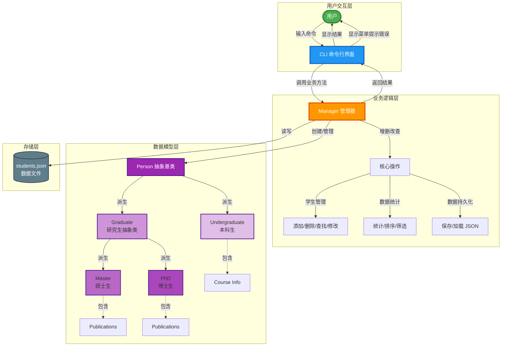
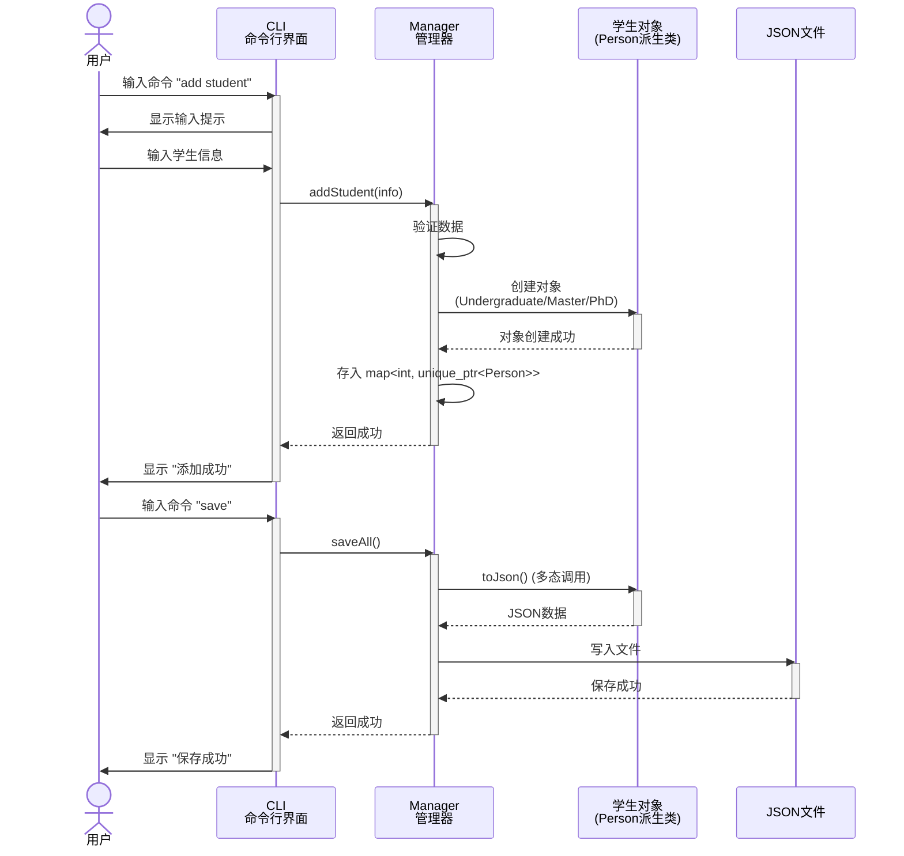

## C++期末大作业


### 第一阶段（核心功能，必须完成）

1. 学生基本信息管理（增删改查）
2. 成绩管理
3. 简单的统计功能
4. 文件读写
5. 基本的 CLI 交互

### 第二阶段（完善功能）

1. 课程管理
2. 选课系统
3. 高级查询和排序
4. 报表生成

### 第三阶段（加分项，时间允许）

1. 奖惩记录
2. 数据备份恢复
3. 命令历史和自动补全
4. 彩色输出（ANSI 颜色）

---

计划使用CMake编译，Gtest测试，JSON储存学生信息，Doxygen生成文档（待定）。

首先需要三种类型的类，学生（包括本科生和硕博生），老师和课程.

本科生要有gpa

```
project/
├── CMakeLists.txt
├── README.md
├── Doxyfile
│
├── include/                      # 头文件目录
│   ├── core/                     # 核心类
│   │   ├── Person.h             # 基类
│   │   ├── Student.h            # 学生类
│   │   ├── Teacher.h            # 教师类
│   │   └── Course.h             # 课程类
│   │
│   ├── manager/                  # 管理器类
│   │   ├── StudentManager.h     # 学生管理器
│   │   ├── TeacherManager.h     # 教师管理器
│   │   ├── CourseManager.h      # 课程管理器
│   │   └── SystemManager.h      # 系统总管理器
│   │
│   ├── utils/                    # 工具类
│   │   ├── FileIO.h             # 文件读写
│   │   ├── JsonHelper.h         # JSON 处理
│   │   ├── Validator.h          # 数据验证
│   │   └── StringUtils.h        # 字符串工具
│   │
│   └── cli/                      # 命令行接口
│       ├── CommandParser.h       # 命令解析器
│       ├── CLI.h                 # CLI 主类
│       └── Commands.h            # 命令处理函数
│
├── src/                          # 源文件目录（与 include 对应）
│   ├── core/
│   │   ├── Person.cpp
│   │   ├── Student.cpp
│   │   ├── Teacher.cpp
│   │   └── Course.cpp
│   │
│   ├── manager/
│   │   ├── StudentManager.cpp
│   │   ├── TeacherManager.cpp
│   │   ├── CourseManager.cpp
│   │   └── SystemManager.cpp
│   │
│   ├── utils/
│   │   ├── FileIO.cpp
│   │   ├── JsonHelper.cpp
│   │   ├── Validator.cpp
│   │   └── StringUtils.cpp
│   │
│   ├── cli/
│   │   ├── CommandParser.cpp
│   │   ├── CLI.cpp
│   │   └── Commands.cpp
│   │
│   └── main.cpp                  # 程序入口
│
├── tests/                        # 测试文件
│   ├── test_student.cpp
│   ├── test_teacher.cpp
│   ├── test_course.cpp
│   ├── test_manager.cpp
│   └── test_fileio.cpp
│
├── data/                         # 数据文件
│   ├── students.json
│   ├── teachers.json
│   ├── courses.json
│   └── sample_data.json
│
└── docs/                         # 文档
    ├── report/                   # LaTeX 报告
    │   ├── main.tex
    │   ├── chapters/
    │   └── figures/
    └── doxygen/                  # Doxygen 生成的文档
```





